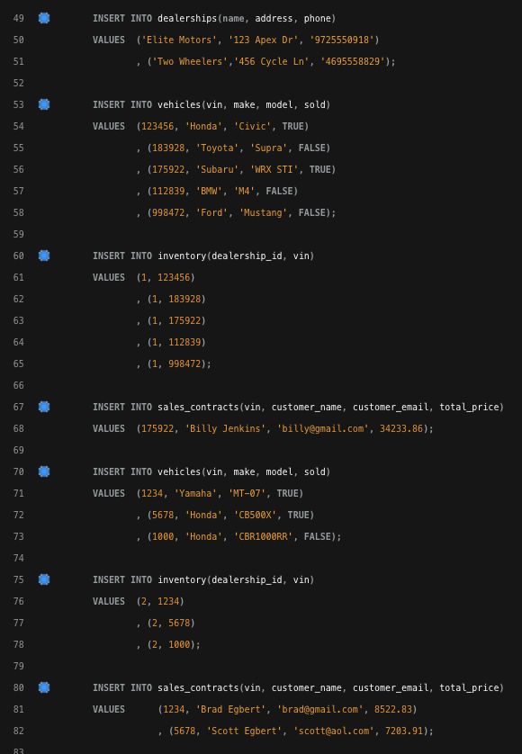

# CarDealershipDatabase

For this project, I created a simple database for a car dealership
using MySQL.

## Diagram
Before writing any code, I decided to create a diagram in Lucid to help me
plan out my tables. I made sure to include which columns were primary/foreign keys,
as well as the data type for each column.

## Creating the Database
Here's the first piece of code I wrote to initialize the database in MySQL:

## Creating the Tables
After creating the database, I needed to load it with some tables.
I made sure to include primary/foreign keys in order to link the tables to each other.

## Loading the Tables
Next, I needed to load the database with some sample data in order to make
sure everything works properly:

Now that the tables are loaded with data, I can move on to writing some queries.

## Query 1
**Get all dealerships**

To get all dealerships, I simply selected all columns from the dealership table.

## Query 2
**Find all vehicles for a specific dealership**

To get all vehicles for a specific dealership, I had to JOIN the vehicles table and
the inventory table. The inventory table is responsible for mapping vehicles to a dealership.

## Query 3
**Find a car by VIN**

To find a car by VIN, all I needed was the vehicles table and a WHERE clause
to specify the VIN to search for.

## Query 4
**Find the dealership where a certain car is located, by VIN**

For this query, I had to JOIN the vehicles, inventory and dealerships tables.
I needed the inventory table to map the specified VIN to a dealership,
and I needed the dealerships table to get the name of the dealership.

## Query 5
**Find all dealerships that have a certain car type**

For this query, I had to JOIN the vehicles, inventory and dealerships tables.
The inventory table was needed to map the vehicle to a dealership, and
the dealership table was needed to search for make & model.

## Query 6
**Get all sales information for a specific dealer for a specific price range**

For this query, I needed to JOIN all 4 tables. I needed dealerships to get the dealership name.
I needed inventory and vehicles to map vehicles to a dealership. And I needed
sales_contracts to get the price of the vehicle(s).

